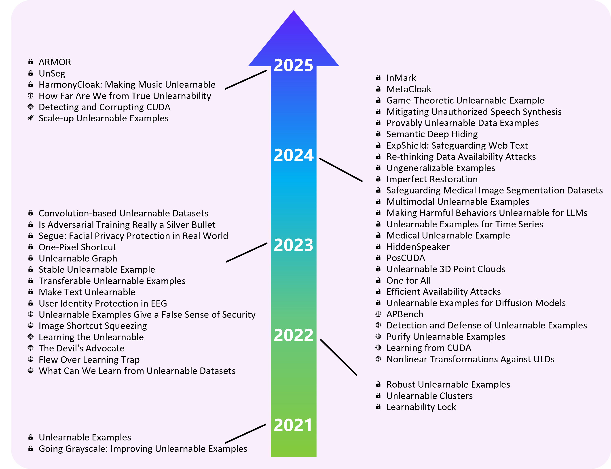

# Awesome Unlearnable Data
[](https://awesome.re) [](https://arxiv.org/abs/2503.23536)  [](https://GitHub.com/Naereen/StrapDown.js/graphs/commit-activity)  [](https://github.com/LiJiahao-Alex/Awesome-UnLearnable-Data/stargazers)


> Carefully curated list of awesome unlearnable data technology resources.

This is the official code implementation of <a href="https://arxiv.org/abs/2503.23536">**A Survey on Unlearnable Data**</a>.

## Table of Contents
- 📖[Overview](#overview)
- 📚[Paper List](#paper-list)
- 📒[Paper Summary](#paper-summary)
- 🗣️[Related Topics](#related-topics)
- 🤝[Contributing](#contributing)
- ⭐[Citation](#citation)
- 🔗[License](#license)

## Star History

<a href="https://www.star-history.com/#LiJiahao-Alex/Awesome-UnLearnable-Data&Date">
 <picture>
   <source media="(prefers-color-scheme: dark)" srcset="https://api.star-history.com/svg?repos=LiJiahao-Alex/Awesome-UnLearnable-Data&type=Date&theme=dark" />
   <source media="(prefers-color-scheme: light)" srcset="https://api.star-history.com/svg?repos=LiJiahao-Alex/Awesome-UnLearnable-Data&type=Date" />
   
 </picture>
</a>

## Overview 
Unlearnable data (ULD) has emerged as an innovative defense technique to prevent machine learning models from learning meaningful patterns from specific data, thus protecting data privacy and security. By introducing perturbations to the training data, ULD degrades model performance, making it difficult for unauthorized models to extract useful representations. Despite the growing significance of ULD, existing surveys predominantly focus on related fields, such as adversarial attacks and machine unlearning, with little attention given to ULD as an independent area of study. This survey fills that gap by offering a comprehensive review of ULD, examining unlearnable data generation methods, public benchmarks, evaluation metrics, theoretical foundations and practical applications. We compare and contrast different ULD approaches, analyzing their strengths, limitations, and trade-offs related to unlearnability, imperceptibility, efficiency and robustness. Moreover, we discuss key challenges, such as balancing perturbation imperceptibility with model degradation and the computational complexity of ULD generation. Finally, we highlight promising future research directions to advance the effectiveness and applicability of ULD, underscoring its potential to become a crucial tool in the evolving landscape of data protection in machine learning.


## Paper List
Unlearnable Data (ULD) techniques have rapidly evolved, giving rise to a diverse range of methods aimed at preventing machine learning models from learning useful features during training. Notably, ULD methods classification is inherently multi-faceted, as different studies categorize these methods based on distinct focal points. Depending on different concerns, ULD methods can be classified according to data type (e.g., images, text, audio), task applicability (e.g., classification, generation, segmentation), technical intent (e.g., defense, attack, acceleration), surrogate model dependency (e.g., surrogate-based vs. surrogate-free scenarios), robustness against adversarial countermeasures, etc. We presents a comprehensive taxonomy that incorporates these diverse perspectives, providing a structured analysis of ULD techniques. Each classification criterion sheds light on different aspects of the technology, offering deeper insights into the evolution and application of ULD methods.

| #  | Study | Publication | Year | Data | Task | Intend | Label | Bounded | Surrogate | Robust |
|----|-------|-------------|------|------|------|--------|-------|---------|-----------|--------|
| 1  | EM[<a href="https://arxiv.org/pdf/2101.04898">Paper</a>, <a href="https://github.com/HanxunH/Unlearnable-Examples">Code</a>] | ICLR | 2021 | Image | Classification | Defense | YES | YES | YES | NO |
| 2  | GrayAugs[<a href="https://arxiv.org/pdf/2111.13244">Paper</a>, <a href="https://github.com/liuzrcc/ULE-GrayAug">Code</a>] | arXiv | 2021 | Image | Classification | Defense | YES | NO | YES | YES |
| 3  | REM[<a href="https://arxiv.org/pdf/2203.14533">Paper</a>, <a href="https://github.com/fshp971/robust-unlearnable-examples">Code</a>] | ICLR | 2022 | Image | Classification | Defense | YES | YES | YES | YES |
| 4  | UC[<a href="https://arxiv.org/pdf/2301.01217">Paper</a>, <a href="https://github.com/jiamingzhang94/Unlearnable-Clusters">Code</a>] | CVPR | 2022 | Image | Classification | Defense | NO | YES | YES | Not Disclosed |
| 5  | LLock[<a href="https://arxiv.org/pdf/2202.03576">Paper</a>, <a href="https://github.com/jinghuichen/Learnability-Lock">Code</a>] | ICLR | 2022 | Image | Classification | Defense | YES | YES | YES | YES |
| 6  | TUE[<a href="https://arxiv.org/pdf/2210.10114">Paper</a>, <a href="https://github.com/renjie3/TUE">Code</a>] | ICLR | 2023 | Image | Classification | Defense | YES | YES | YES | Not Disclosed |
| 7  | OPS[<a href="https://arxiv.org/pdf/2205.12141">Paper</a>, <a href="https://github.com/cychomatica/One-Pixel-Shotcut">Code</a>] | ICLR | 2023 | Image | Classification | Defense | YES | NO | NO | YES |
| 8  | CUDA[<a href="https://arxiv.org/pdf/2303.04278">Paper</a>, <a href="https://github.com/vinusankars/Convolution-based-Unlearnability">Code</a>] | CVPR | 2023 | Image | Classification | Defense | YES | NO | NO | YES |
| 9  | SEM[<a href="https://arxiv.org/pdf/2311.13091">Paper</a>, <a href="https://github.com/liuyixin-louis/Stable-Unlearnable-Example">Code</a>] | AAAI | 2023 | Image | Classification | Defense | YES | YES | YES | YES |
| 10 | Segue[<a href="https://arxiv.org/pdf/2310.16061v1">Paper</a>] | arXiv | 2023 | Image | Generation | Defense | NO | YES | YES | YES |
| 11 | UT[<a href="https://arxiv.org/pdf/2307.00456">Paper</a>] | ACLW | 2023 | Text | Classification, Q&A | Defense | YES | N.A. | YES | Not Disclosed |
| 12 | EMinS[<a href="https://arxiv.org/pdf/2303.02568">Paper</a>] | NDSS | 2023 | Graph | Classification | Defense | YES | N.A. | YES | Not Disclosed |
| 13 | JCDP[<a href="https://arxiv.org/pdf/2305.09241">Paper</a>, <a href="https://github.com/jiangw-0/LE_JCDP">Code</a>] | MM | 2023 | Image | Classification | Attack | N.A. | N.A. | N.A. | N.A. |
| 14 | ISS[<a href="https://arxiv.org/pdf/2301.13838">Paper</a>, <a href="https://github.com/liuzrcc/ImageShortcutSqueezing">Code</a>] | ICML | 2023 | Image | Classification | Attack | N.A. | N.A. | N.A. | N.A. |
| 15 | UEraser[<a href="https://arxiv.org/pdf/2303.15127">Paper</a>, <a href="https://github.com/lafeat/ueraser">Code</a>] | arXiv | 2023 | Image | Classification | Attack | N.A. | N.A. | N.A. | N.A. |
| 16 | AVATAR[<a href="https://arxiv.org/pdf/2303.08500">Paper</a>, <a href="https://github.com/hmdolatabadi/AVATAR">Code</a>] | SatML | 2023 | Image | Classification | Attack | N.A. | N.A. | N.A. | N.A. |
| 17 | ST[<a href="https://arxiv.org/pdf/2306.02064">Paper</a>, <a href="https://github.com/CherryBlueberry/ST">Code</a>] | arXiv | 2023 | Image | Classification | Attack | N.A. | N.A. | N.A. | N.A. |
| 18 | OProj[<a href="https://arxiv.org/pdf/2305.19254">Paper</a>, <a href="https://github.com/psandovalsegura/learn-from-unlearnable">Code</a>] | NIPS | 2023 | Image | Classification | Attack | N.A. | N.A. | N.A. | N.A. |
| 19 | UEEG[<a href="https://arxiv.org/pdf/2412.09854">Paper</a>] | TNNLS | 2023 | EEG | Classification | Defense | YES | NO | YES | Not Disclosed |
| 20 | EntF[<a href="https://openreview.net/pdf?id=zKvm1ETDOq">Paper</a>, <a href="https://github.com/WenRuiUSTC/EntF">Code</a>] | ICLR | 2023 | Image | Classification | Defense | YES | YES | YES | YES |
| 21 | ASR[<a href="https://arxiv.org/pdf/2305.10691">Paper</a>, <a href="https://github.com/EuterpeK/Rethinking-Data-Availability-Attacks">Code</a>] | CVPR | 2024 | Image | Classification | Defense | YES | YES | YES | YES |
| 22 | PUE[<a href="https://arxiv.org/pdf/2405.03316">Paper</a>, <a href="https://github.com/NeuralSec/certified-data-learnability">Code</a>] | NDSS | 2024 | Image | Classification | Defense | YES | YES | YES | YES |
| 23 | SecVec[<a href="https://arxiv.org/pdf/2311.02105">Paper</a>] | ACLF | 2024 | Text | Generation | Defense | YES | N.A. | YES | Not Disclosed |
| 24 | UE4TS[<a href="https://arxiv.org/pdf/2402.02028">Paper</a>] | PAKDD | 2024 | Timeseries | Classification | Defense | YES | YES | YES | Not Disclosed |
| 25 | SALM[<a href="https://arxiv.org/pdf/2403.10573">Paper</a>] | ICMLW | 2024 | Medical Image | Classification | Defense | YES | YES | YES | Not Disclosed |
| 26 | EUDP[<a href="https://arxiv.org/pdf/2306.01902">Paper</a>] | ICLRW | 2024 | Image | Generation | Defense | NO | YES | YES | Not Disclosed |
| 27 | MEM[<a href="https://arxiv.org/pdf/2407.16307">Paper</a>, <a href="https://github.com/thinwayliu/Multimodal-Unlearnable-Examples">Code</a>] | MM | 2024 | Image, Text | Retrieval | Defense | YES | YES | YES | Not Disclosed |
| 28 | DH[<a href="https://arxiv.org/pdf/2406.17349">Paper</a>] | TIFS | 2024 | Image | Classification | Defense | YES | YES | YES | YES |
| 29 | HiddenSpeaker[<a href="https://arxiv.org/pdf/2405.15655v2">Paper</a>] | IJCNN | 2024 | Audio | Verification | Defense | YES | YES | YES | Not Disclosed |
| 30 | PosCUDA[<a href="https://arxiv.org/pdf/2401.02135">Paper</a>] | arXiv | 2024 | Audio | Classification | Defense | YES | NO | NO | Not Disclosed |
| 31 | GUE[<a href="https://arxiv.org/pdf/2401.17523">Paper</a>, <a href="https://github.com/hong-xian/gue">Code</a>] | AAAI | 2024 | Image | Classification | Defense | YES | NO | YES | YES |
| 32 | DVAE[<a href="https://arxiv.org/pdf/2405.01460">Paper</a>, <a href="https://github.com/yuyi-sd/D-VAE">Code</a>] | ICML | 2024 | Image | Classification | Attack | N.A. | N.A. | N.A. | N.A. |
| 33 | RSK[<a href="https://arxiv.org/pdf/2411.01742">Paper</a>, <a href="https://github.com/aseriesof-tubes/RSK">Code</a>] | NIPSW | 2024 | Image | Classification | Attack | N.A. | N.A. | N.A. | N.A. |
| 34 | UDP[<a href="https://arxiv.org/pdf/2312.08898">Paper</a>, <a href="https://github.com/hala64/udp">Code</a>] | AAAI | 2024 | Image | Classification | Attack | N.A. | N.A. | N.A. | N.A. |
| 35 | NLT4UD[<a href="https://arxiv.org/pdf/2406.02883">Paper</a>] | arXiv | 2024 | Image | Classification | Attack | N.A. | N.A. | N.A. | N.A. |
| 36 | UGE[<a href="https://arxiv.org/pdf/2404.14016">Paper</a>] | CVPR | 2024 | Image | Classification | Defense | YES | YES | YES | Not Disclosed |
| 37 | UPC[<a href="https://arxiv.org/pdf/2410.03644">Paper</a>, <a href="https://github.com/CGCL-codes/UnlearnablePC">Code</a>] | NIPS | 2024 | Point Clouds | Classification, Segmentation | Defense | YES | N.A. | YES | Not Disclosed |
| 38 | 14A[<a href="https://openreview.net/pdf?id=vSerUPYFtB">Paper</a>, <a href="https://github.com/xiye7lai/UnlearnableConcept">Code</a>] | ICML | 2024 | Image | Classification | Defense | NO | YES | YES | Not Disclosed |
| 39 | MetaCloak[<a href="https://arxiv.org/pdf/2311.13127">Paper</a>, <a href="https://github.com/liuyixin-louis/MetaCloak">Code</a>] | CVPR | 2024 | Image | Generation | Defense | NO | NO | YES | Not Disclosed |
| 40 | AUEAPP[<a href="https://arxiv.org/pdf/2402.04010">Paper</a>, <a href="https://github.com/EhanW/AUE-AAP">Code</a>] | NPIS | 2024 | Image | Classification | Defense | YES | YES | YES | YES |
| 41 | APBench[<a href="https://arxiv.org/pdf/2308.03258">Paper</a>, <a href="https://github.com/lafeat/apbench">Code</a>] | TMLR | 2024 | Image | Classification | Evaluate | N.A. | N.A. | N.A. | N.A. |
| 42 | UMed[<a href="https://arxiv.org/pdf/2403.14250">Paper</a>] | arXiv | 2024 | Medical Image | Segmentation | Defense | YES | YES | YES | YES |
| 43 | InMark[<a href="https://openaccess.thecvf.com/content/CVPR2024/papers/Liu_Countering_Personalized_Text-to-Image_Generation_with_Influence_Watermarks_CVPR_2024_paper.pdf">Paper</a>] | CVPR | 2024 | Image | Generation | Defense | NO | YES | YES | Not Disclosed |
| 44 | POP[<a href="https://arxiv.org/pdf/2410.20742">Paper</a>, <a href="https://github.com/wxzyd123/Pivotal_Objective_Perturbation">Code</a>] | CCSW | 2024 | Audio | Generation | Defense | NO | YES | YES | Not Disclosed |
| 45 | ExpShield[<a href="https://arxiv.org/pdf/2412.21123">Paper</a>] | arXiv | 2024 | Text | Customized | Defense | NO | N.A. | YES | Not Disclosed |
| 46 | IRP[<a href="https://dr.ntu.edu.sg/bitstream/10356/179131/3/IRP_Main_ECCV_2024.pdf">Paper</a>, <a href="https://github.com/lyumingzhi/IRP">Code</a>] | ECCV | 2024 | Image | Classification | Defense | YES | NO | NO | YES |
| 47 | ARMOR[<a href="https://arxiv.org/pdf/2501.08862">Paper</a>] | arXiv | 2025 | Image | Classification | Defense | YES | YES | YES | YES |
| 48 | HPC4UE[<a href="https://arxiv.org/pdf/2501.06080">Paper</a>, <a href="https://github.com/hrlblab/UE_HPC">Code</a>] | arXiv | 2025 | Image | Classification | Speedup | N.A. | N.A. | N.A. | N.A. |
| 49 | UnSeg[<a href="https://arxiv.org/pdf/2410.09909">Paper</a>, <a href="https://github.com/sunye23/UnSeg">Code</a>] | NIPS | 2025 | Image | Segmentation | Defense | YES | YES | YES | YES |
| 50 | HarmonyCloak[<a href="https://mosis.eecs.utk.edu/publications/meerza2024harmonycloak.pdf">Paper</a>] | S&P | 2025 | Music | Generation | Defense | NO | NO | YES | Not Disclosed |
| 51 | COIN[<a href="https://arxiv.org/pdf/2311.18403">Paper</a>, <a href="https://github.com/wxldragon/COIN">Code</a>] | AAAI | 2025 | Image | Classification | Attack | N.A. | N.A. | N.A. | N.A. |
| 52 | SALUD[<a href="https://openreview.net/pdf?id=I4Lq2RJ0eJ">Paper</a>, <a href="https://github.com/MLsecurityLab/HowFarAreFromTrueUnlearnability.git">Code</a>] | ICLR | 2025 | Image | Classification | Evaluate | N.A. | N.A. | N.A. | N.A. |


## Paper Summary

| #  | Study | Publication | Year | Overview |
|----|-------|-------------|------|----------|
| 1 | EM[<a href="https://arxiv.org/pdf/2101.04898">Paper</a>, <a href="https://github.com/HanxunH/Unlearnable-Examples">Code</a>] | ICLR | 2021 | Propose error-minimizing noise to keep data visually unchanged while making the trained model behave nearly randomly, protecting personal data. |
| 2 | GrayAugs[<a href="https://arxiv.org/pdf/2111.13244">Paper</a>, <a href="https://github.com/liuzrcc/ULE-GrayAug">Code</a>] | arXiv | 2021 | Use grayscale and data augmentation to analyze the impact of noise on unlearnable data and validate the effectiveness of the preliminary method. |
| 3 | REM[<a href="https://arxiv.org/pdf/2203.14533">Paper</a>, <a href="https://github.com/fshp971/robust-unlearnable-examples">Code</a>] | ICLR | 2022 | Propose robust error-minimizing noise to enhance the protection of data under adversarial training. |
| 4 | UC[<a href="https://arxiv.org/pdf/2301.01217">Paper</a>, <a href="https://github.com/jiamingzhang94/Unlearnable-Clusters">Code</a>] | CVPR | 2022 | Use clustering methods to generate perturbations independent of labels, reducing category dependence and enhancing flexibility. |
| 5 | LLock[<a href="https://arxiv.org/pdf/2202.03576">Paper</a>, <a href="https://github.com/jinghuichen/Learnability-Lock">Code</a>] | ICLR | 2022 | Propose adversarial reversible transformations, which can be considered as image-to-image mappings to encrypt data samples. Authorized clients can use specific keys to unlock the learnability of protected datasets and train models normally. |
| 6 | TUE[<a href="https://arxiv.org/pdf/2210.10114">Paper</a>, <a href="https://github.com/renjie3/TUE">Code</a>] | ICLR | 2023 | Transferable unlearnable perturbations across models and datasets. |
| 7 | OPS[<a href="https://arxiv.org/pdf/2205.12141">Paper</a>, <a href="https://github.com/cychomatica/One-Pixel-Shotcut">Code</a>] | ICLR | 2023 | Propose that perturbing a single pixel can produce significant effects, revealing DNN's preference for local perturbations during training. |
| 8 | CUDA[<a href="https://arxiv.org/pdf/2303.04278">Paper</a>, <a href="https://github.com/vinusankars/Convolution-based-Unlearnability">Code</a>] | CVPR | 2023 | Embed category-specific perturbations in the frequency domain using convolution kernels to address the slow iteration issue in traditional unlearnable methods. |
| 9 | SEM[<a href="https://arxiv.org/pdf/2311.13091">Paper</a>, <a href="https://github.com/liuyixin-louis/Stable-Unlearnable-Example">Code</a>] | AAAI | 2023 | Propose a stable version of error-minimizing noise to ensure unlearnable data remains effective under different training conditions. |
| 10 | Segue[<a href="https://arxiv.org/pdf/2310.16061v1">Paper</a>] | arXiv | 2023 | Use auxiliary information to guide the generation of unlearnable samples for facial privacy protection. |
| 11 | UT[<a href="https://arxiv.org/pdf/2307.00456">Paper</a>] | ACLW | 2023 | Generate unlearnable text using gradient-based search techniques. |
| 12 | EMinS[<a href="https://arxiv.org/pdf/2303.02568">Paper</a>] | NDSS | 2023 | This paper proposes a new method for generating unlearnable graph examples. |
| 13 | JCDP[<a href="https://arxiv.org/pdf/2305.09241">Paper</a>, <a href="https://github.com/jiangw-0/LE_JCDP">Code</a>] | MM | 2023 | Use diffusion models to restore unlearnable data to a learnable state, revealing security risks in current unlearnable methods. |
| 14 | ISS[<a href="https://arxiv.org/pdf/2301.13838">Paper</a>, <a href="https://github.com/liuzrcc/ImageShortcutSqueezing">Code</a>] | ICML | 2023 | Use image compression techniques to weaken the shortcuts formed by perturbations, enabling the model to recapture the original semantic information. |
| 15 | UEraser[<a href="https://arxiv.org/pdf/2303.15127">Paper</a>, <a href="https://github.com/lafeat/ueraser">Code</a>] | arXiv | 2023 | Suppress the impact of unlearnable perturbations through adversarial data augmentation and restore data learnability. |
| 16 | AVATAR[<a href="https://arxiv.org/pdf/2303.08500">Paper</a>, <a href="https://github.com/hmdolatabadi/AVATAR">Code</a>] | SatML | 2023 | Recover learnability from unlearnable data based on diffusion models, breaking through unlearnability protection. |
| 17 | ST[<a href="https://arxiv.org/pdf/2306.02064">Paper</a>, <a href="https://github.com/CherryBlueberry/ST">Code</a>] | arXiv | 2023 | Use a staged training strategy to prevent the model from falling into perturbation feature traps too early, restoring learning of data semantics. |
| 18 | OProj[<a href="https://arxiv.org/pdf/2305.19254">Paper</a>, <a href="https://github.com/psandovalsegura/learn-from-unlearnable">Code</a>] | NIPS | 2023 | Provide a deep theoretical and experimental analysis of the nature and limitations of unlearnable data, proposing Orthogonal Projection to restore learnability. |
| 19 | UEEG[<a href="https://arxiv.org/pdf/2412.09854">Paper</a>] | TNNLS | 2023 | Proposes two methods to convert raw EEG data into identity-unlearnable EEG data, removing user identity information while maintaining good performance for brain-computer interface (BCI) tasks. |
| 20 | EntF[<a href="https://openreview.net/pdf?id=zKvm1ETDOq">Paper</a>, <a href="https://github.com/WenRuiUSTC/EntF">Code</a>] | ICLR | 2023 | Propose a poisoning method based on indifferentiable features to significantly reduce the impact of adversarial training. |
| 21 | ASR[<a href="https://arxiv.org/pdf/2305.10691">Paper</a>, <a href="https://github.com/EuterpeK/Rethinking-Data-Availability-Attacks">Code</a>] | CVPR | 2024 | Discuss the limitations of existing unlearnable methods from the perspective of data availability attacks, proposing new ideas for data protection. |
| 22 | PUE[<a href="https://arxiv.org/pdf/2405.03316">Paper</a>, <a href="https://github.com/NeuralSec/certified-data-learnability">Code</a>] | NDSS | 2024 | This paper proposes a theoretical mechanism to evaluate and verify the learnability of unlearnable datasets through parameter smoothing. |
| 23 | SecVec[<a href="https://arxiv.org/pdf/2311.02105">Paper</a>] | ACLF | 2024 | Propose a controllable training framework that leverages the concept of safe vectors to make harmful behaviors unlearnable during fine-tuning. |
| 24 | UE4TS[<a href="https://arxiv.org/pdf/2402.02028">Paper</a>] | PAKDD | 2024 | Propose a method for generating unlearnable examples to protect time-series data from unauthorized training by deep learning models. |
| 25 | SALM[<a href="https://arxiv.org/pdf/2403.10573">Paper</a>] | ICMLW | 2024 | Propose a sparse-aware local masking method for medical images, selectively perturbing important pixel regions to generate unlearnable data. |
| 26 | EUDP[<a href="https://arxiv.org/pdf/2306.01902">Paper</a>] | ICLRW | 2024 | Unlearnable data for diffusion models, protecting unauthorized data generation. |
| 27 | MEM[<a href="https://arxiv.org/pdf/2407.16307">Paper</a>, <a href="https://github.com/thinwayliu/Multimodal-Unlearnable-Examples">Code</a>] | MM | 2024 | This paper proposes multi-step error minimization, a new optimization process for generating multimodal unlearnable samples. |
| 28 | DH[<a href="https://arxiv.org/pdf/2406.17349">Paper</a>] | TIFS | 2024 | Traditional unlearnable perturbations targeting low-level features are easily affected by common data augmentation strategies. This paper proposes an adaptive approach to hide semantic images with rich high-level features, making them more robust to adversarial measures. |
| 29 | HiddenSpeaker[<a href="https://arxiv.org/pdf/2405.15655v2">Paper</a>] | IJCNN | 2024 | This paper embeds imperceptible perturbations into training speech samples, making them unlearnable for deep learning-based speaker verification systems. |
| 30 | PosCUDA[<a href="https://arxiv.org/pdf/2401.02135">Paper</a>] | arXiv | 2024 | Propose a location-based class-level convolution to create unlearnable audio datasets. |
| 31 | GUE[<a href="https://arxiv.org/pdf/2401.17523">Paper</a>, <a href="https://github.com/hong-xian/gue">Code</a>] | AAAI | 2024 | Model the unlearnable data generation process from a game-theoretic perspective, solving for equilibrium to generate optimal perturbations that break protection. |
| 32 | DVAE[<a href="https://arxiv.org/pdf/2405.01460">Paper</a>, <a href="https://github.com/yuyi-sd/D-VAE">Code</a>] | ICML | 2024 | Use constrained VAE pretraining purification to remove perturbations and restore the learnability of unlearnable data. |
| 33 | RSK[<a href="https://arxiv.org/pdf/2411.01742">Paper</a>, <a href="https://github.com/aseriesof-tubes/RSK">Code</a>] | NIPSW | 2024 | Propose a method to restore learnability in CUDA samples through sharpening and DCT frequency filtering. |
| 34 | UDP[<a href="https://arxiv.org/pdf/2312.08898">Paper</a>, <a href="https://github.com/hala64/udp">Code</a>] | AAAI | 2024 | Use network-based detection methods to identify unlearnable examples. |
| 35 | NLT4UD[<a href="https://arxiv.org/pdf/2406.02883">Paper</a>] | arXiv | 2024 | Propose an effective nonlinear transformation framework that enables effective learning from traditionally unlearnable data. |
| 36 | UGE[<a href="https://arxiv.org/pdf/2404.14016">Paper</a>] | CVPR | 2024 | Extend the concept of unlearnable data to conditional data learnability, showcasing learnability for authorized users while maintaining unlearnability for potential hackers. |
| 37 | UPC[<a href="https://arxiv.org/pdf/2410.03644">Paper</a>, <a href="https://github.com/CGCL-codes/UnlearnablePC">Code</a>] | NIPS | 2024 | Propose the first overall unlearnable framework for 3D point clouds. |
| 38 | 14A[<a href="https://openreview.net/pdf?id=vSerUPYFtB">Paper</a>, <a href="https://github.com/xiye7lai/UnlearnableConcept">Code</a>] | ICML | 2024 | Propose a universal perturbation generator using conceptually unlearnable data. |
| 39 | MetaCloak[<a href="https://arxiv.org/pdf/2311.13127">Paper</a>, <a href="https://github.com/liuyixin-louis/MetaCloak">Code</a>] | CVPR | 2024 | Propose a meta-learning framework to solve the bi-level optimization suboptimal problem of error-minim |
| 40 | AUEAPP[<a href="https://arxiv.org/pdf/2402.04010">Paper</a>, <a href="https://github.com/EhanW/AUE-AAP">Code</a>] | NPIS | 2024 | Propose achieving both supervised and contrastive unlearnability simultaneously. |
| 41 | APBench[<a href="https://arxiv.org/pdf/2308.03258">Paper</a>, <a href="https://github.com/lafeat/apbench">Code</a>] | TMLR | 2024 | Propose the first benchmark for usability poisoning attacks and defenses. |
| 42 | UMed[<a href="https://arxiv.org/pdf/2403.14250">Paper</a>] | arXiv | 2024 | Propose a method for generating unlearnable medical images, incorporating prior knowledge of the data and protecting images by introducing contour and texture perturbations. |
| 43 | InMark[<a href="https://openaccess.thecvf.com/content/CVPR2024/papers/Liu_Countering_Personalized_Text-to-Image_Generation_with_Influence_Watermarks_CVPR_2024_paper.pdf">Paper</a>] | CVPR | 2024 | Propose unlearnable examples for diffusion models by embedding watermarks in influential pixels. |
| 44 | POP[<a href="https://arxiv.org/pdf/2410.20742">Paper</a>, <a href="https://github.com/wxzyd123/Pivotal_Objective_Perturbation">Code</a>] | CCSW | 2024 | Apply imperceptible error-minimizing noise to raw speech samples to prevent them from being effectively learned for text-to-speech synthesis models, thus preventing the generation of high-quality deepfake speech. |
| 45 | ExpShield[<a href="https://arxiv.org/pdf/2412.21123">Paper</a>] | arXiv | 2024 | Restrict data abuse during LLM training without affecting readability. |
| 46 | IRP[<a href="https://dr.ntu.edu.sg/bitstream/10356/179131/3/IRP_Main_ECCV_2024.pdf">Paper</a>, <a href="https://github.com/lyumingzhi/IRP">Code</a>] | ECCV | 2024 | Based on CUDA theoretical analysis, propose imperfect recovery poisoning aimed at achieving strong poisoning effects while maintaining high image quality. |
| 47 | ARMOR[<a href="https://arxiv.org/pdf/2501.08862">Paper</a>] | arXiv | 2025 | Propose using data augmentation strategies to disrupt the detectability of perturbations in unlearnable data, enhancing protective effects. |
| 48 | HPC4UE[<a href="https://arxiv.org/pdf/2501.06080">Paper</a>, <a href="https://github.com/hrlblab/UE_HPC">Code</a>] | arXiv | 2025 | Study the feasibility of unlearnable data in high-performance computing, exploring the impact of batch size on data unlearnability. |
| 49 | UnSeg[<a href="https://arxiv.org/pdf/2410.09909">Paper</a>, <a href="https://github.com/sunye23/UnSeg">Code</a>] | NIPS | 2025 | For segmentation tasks, propose a new unlearnable framework to train a universal unlearnable noise generator that can convert any downstream image into an unlearnable version for segmentation tasks. |
| 50 | HarmonyCloak[<a href="https://mosis.eecs.utk.edu/publications/meerza2024harmonycloak.pdf">Paper</a>] | S&P | 2025 | Propose a defense mechanism using generative AI models to prevent exploitative use of artwork, particularly in instrumental contexts. |
| 51 | COIN[<a href="https://arxiv.org/pdf/2311.18403">Paper</a>, <a href="https://github.com/wxldragon/COIN">Code</a>] | AAAI | 2025 | Propose a method to detect CUDA perturbations and break their protective effects through reverse engineering. |
| 52 | SALUD[<a href="https://openreview.net/pdf?id=I4Lq2RJ0eJ">Paper</a>, <a href="https://github.com/MLsecurityLab/HowFarAreFromTrueUnlearnability.git">Code</a>] | ICLR | 2025 | Propose unlearnability distance, based on the distribution of parameters in clean and poisoned models, to measure data unlearnability, aiming to promote community awareness of the capability boundaries of existing unlearnable methods. |

[<kbd>▲</kbd> Back to Top](#table-of-contents)
## Related Topics
- Unlearnable Data
- Data Privacy
- Deep Learning Security
- Learnability
- Shortcut Learning
- Privacy-Preserving Machine Learning

[<kbd>▲</kbd> Back to Top](#table-of-contents)

## Contributing
Feel free to submit pull requests with additional ULD techniques or corrections. If you have any suggestions or find our work helpful, feel free to contact us: Jiahao Li (www.lijiahao@live.cn)


[<kbd>▲</kbd> Back to Top](#table-of-contents)

## Citation
If this project has helped your research, please cite the following review papers:
```
@misc{li2025surveyunlearnabledata,
      title={A Survey on Unlearnable Data}, 
      author={Jiahao Li and Yiqiang Chen and Yunbing Xing and Yang Gu and Xiangyuan Lan},
      year={2025},
      eprint={2503.23536},
      archivePrefix={arXiv},
      primaryClass={cs.LG},
      url={https://arxiv.org/abs/2503.23536},
      }
```

⭐ **If you find this list useful, give it a star!** ⭐

[<kbd>▲</kbd> Back to Top](#table-of-contents)

## License
To the extent possible under law, <a href="https://lijiahao-alex.github.io/homepage/">Jiahao Li</a> has retained all copyright and related or neighboring rights to this work.

[<kbd>▲</kbd> Back to Top](#table-of-contents)
